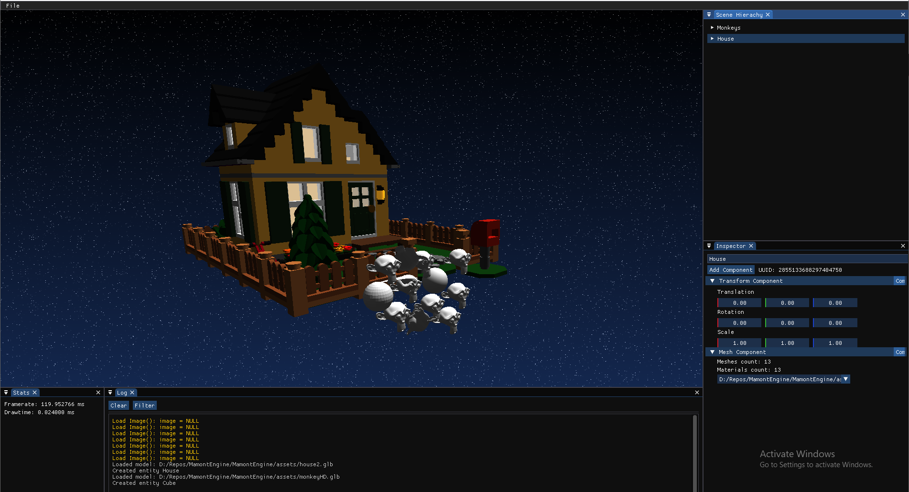

# MamontEngine
 Game Engine using Vulkan

## Features
- GLTF model loading
- ECS Integration
- Save/Load scene
- Cascade Shadow Mapping
- Physically Based Rendering

## Dependencies
- Vulkan SDK (1.4)
- CMake 3.2
- DearImGui
- SDL3
- GLM
- VkBoostrap
- Entt
- Fmt
- Fastgltf
- Stb
- Vma
